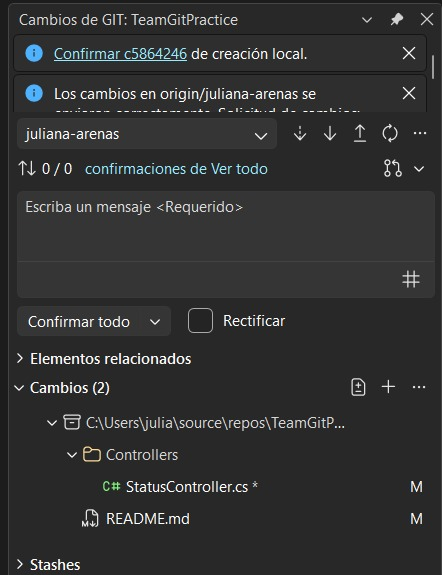
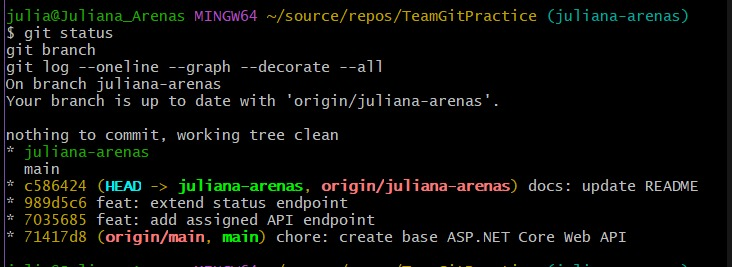
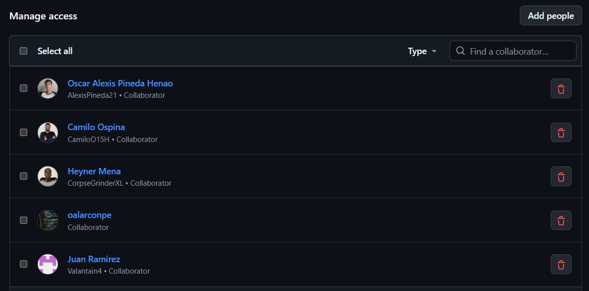

# EVIDENCIAS - Práctica 1 Git Colaborativo

## Equipo

**Los Indesplegables**

## Proyecto

**TeamGitPractice**

---

## 1. Participación individual

| Integrante | Rama personal | Commit por consola | Commit desde Visual Studio | Pull Request | Reviewer |
|---|---|---|---|---|---|
| Juliana Arenas Arias | `juliana-arenas` | `7035685` | `989d5c6` | `#1` | Juan Andres Ramirez Castañeda |
| Juan Andres Ramirez Castañeda | `juan-ramirez` | `60e9071` | `803c850` | `#4` | Heyner Mena Campaña |
| Heyner Mena Campaña | `heyner-mena` | `61cf668` | `4172964` | `#3` | Camilo Ospina Hernández |
| Camilo Ospina Hernández | `camilo-ospina` | `2a7525b` | `a7eccf1` | `#5` | Oscar Alexis Pineda Henao |
| Oscar Alexis Pineda Henao | `oscar-pineda` | `eb5374c` | `5212081` | `#2` | Juliana Arenas Arias |

---

## 2. Funcionalidades desarrolladas

### Juliana Arenas Arias

**Rama:** `juliana-arenas`  
**Archivo:** `Controllers/StatusController.cs`

Endpoints desarrollados:

- `GET /api/status`
- `GET /api/status/team`

### Juan Andres Ramirez Castañeda

**Rama:** `juan-ramirez`  
**Archivo:** `Controllers/MembersController.cs`

Endpoints desarrollados:

- `GET /api/members`
- `GET /api/members/count`

### Heyner Mena Campaña

**Rama:** `heyner-mena`  
**Archivo:** `Controllers/VersionController.cs`

Endpoints desarrollados:

- `GET /api/version`
- `GET /api/version/platform`

### Camilo Ospina Hernández

**Rama:** `camilo-ospina`  
**Archivo:** `Controllers/HealthController.cs`

Endpoints desarrollados:

- `GET /api/health`
- `GET /api/health/time`

### Oscar Alexis Pineda Henao

**Rama:** `oscar-pineda`  
**Archivo:** `Controllers/InfoController.cs`

Endpoints desarrollados:

- `GET /api/info`
- `GET /api/info/tools`

---

## 3. Pull Requests y revisiones

| Pull Request | Autor | Rama | Reviewer | Estado |
|---|---|---|---|---|
| `#1` | Juliana Arenas Arias | `juliana-arenas` | Juan Andres Ramirez Castañeda | Aprobado y mergeado |
| `#4` | Juan Andres Ramirez Castañeda | `juan-ramirez` | Heyner Mena Campaña | Aprobado y mergeado |
| `#3` | Heyner Mena Campaña | `heyner-mena` | Camilo Ospina Hernández | Aprobado y mergeado |
| `#5` | Camilo Ospina Hernández | `camilo-ospina` | Oscar Alexis Pineda Henao | Aprobado y mergeado |
| `#2` | Oscar Alexis Pineda Henao | `oscar-pineda` | Juliana Arenas Arias | Aprobado y mergeado |

Cada integrante desarrolló su funcionalidad en una rama personal.

Posteriormente se creó un Pull Request hacia `main`, el cual fue revisado y aprobado por otro integrante antes de realizar el merge.

---

## 4. Conflicto de integración

El conflicto intencional fue realizado entre:

- **Juan Andres Ramirez Castañeda**
- **Heyner Mena Campaña**

El archivo utilizado fue:

`TeamMessage.txt`

### Cambio realizado por Juan Andres Ramirez Castañeda

Juan modificó el archivo dejando:

```text
Estado del proyecto: preparado para entrega.
```

El commit correspondiente fue:

```text
9a9a5da feat: update team message for delivery
```

### Cambio realizado por Heyner Mena Campaña

Heyner modificó la misma línea dejando:

```text
Estado del proyecto: en validación.
```

El commit correspondiente fue:

```text
fa3bb8d chore: update team message status
```

El Pull Request de Juan fue integrado primero a `main`.

Posteriormente, Heyner actualizó su rama `heyner-mena` con los cambios existentes en `main`.

Git detectó un conflicto debido a que ambas ramas habían modificado la misma línea del archivo `TeamMessage.txt`.

El equipo resolvió el conflicto dejando como contenido final:

```text
Estado del proyecto: preparado para entrega y en validación.
```

### Evidencia de resolución

**Pull Request:** `#3`

**Hash del commit de resolución:**

```text
d9cd623
```

**Mensaje del commit:**

```text
fix: resolve team message conflict
```

---

## 5. Evidencia de git restore

**Responsable:** Camilo Ospina Hernández  
**Rama:** `camilo-ospina`

Se realizó un cambio temporal en `README.md` para demostrar el uso de `git restore`.

Los comandos utilizados fueron:

```bash
git diff README.md
git restore README.md
git status
```

El comando `git restore README.md` permitió descartar los cambios locales realizados sobre el archivo sin generar un nuevo commit.

---

## 6. Evidencia de git restore --staged

**Responsable:** Camilo Ospina Hernández  
**Rama:** `camilo-ospina`

Se realizó nuevamente una modificación temporal en `README.md` y se agregó el archivo al área de staging:

```bash
git add README.md
git status
```

Posteriormente, el archivo fue retirado del área de staging utilizando:

```bash
git restore --staged README.md
git status
```

Finalmente, el cambio temporal fue descartado:

```bash
git restore README.md
```

Esta actividad permitió comprobar la diferencia entre un cambio realizado localmente y un cambio agregado al área de staging.

---

## 7. Evidencia de git revert

**Responsable:** Oscar Alexis Pineda Henao

Para esta demostración se utilizó la rama auxiliar:

`oscar-pineda-revert`

Se creó el archivo:

`TemporaryNote.txt`

con el contenido:

```text
Cambio temporal
```

Posteriormente se realizó el commit:

```text
95c742c test: add temporary note
```

Luego se utilizó `git revert` para revertir el cambio mediante un nuevo commit:

```text
2a8c2a7 Revert "test: add temporary note"
```

### Commits de la demostración

**Commit temporal:**

```text
95c742c
```

**Commit generado por revert:**

```text
2a8c2a7
```

La rama `oscar-pineda-revert` se conserva como evidencia y no fue integrada a `main`.

---

## 8. Evidencias gráficas

### Git Changes - Visual Studio Community 2026

La siguiente captura evidencia el uso del panel Git Changes de Visual Studio Community 2026 durante el trabajo con el repositorio.



---

### Git Bash / Terminal

La siguiente captura evidencia el uso de Git desde consola, mostrando información del repositorio, ramas e historial.



---

### Colaboradores del repositorio

La siguiente captura evidencia que los integrantes del equipo y el profesor fueron agregados como colaboradores del repositorio.

El usuario de GitHub del profesor es:

`oalarconpe`



---

## 9. Estado final del proyecto

Después de integrar los Pull Requests, la rama `main` contiene los cinco controladores desarrollados por el equipo:

```text
Controllers/
├── StatusController.cs
├── MembersController.cs
├── VersionController.cs
├── HealthController.cs
└── InfoController.cs
```

### Endpoints finales

| Método | Endpoint | Responsable |
|---|---|---|
| GET | `/api/status` | Juliana Arenas Arias |
| GET | `/api/status/team` | Juliana Arenas Arias |
| GET | `/api/members` | Juan Andres Ramirez Castañeda |
| GET | `/api/members/count` | Juan Andres Ramirez Castañeda |
| GET | `/api/version` | Heyner Mena Campaña |
| GET | `/api/version/platform` | Heyner Mena Campaña |
| GET | `/api/health` | Camilo Ospina Hernández |
| GET | `/api/health/time` | Camilo Ospina Hernández |
| GET | `/api/info` | Oscar Alexis Pineda Henao |
| GET | `/api/info/tools` | Oscar Alexis Pineda Henao |

La API fue ejecutada desde la rama `main` y se verificó el funcionamiento de las funcionalidades desarrolladas por los cinco integrantes.

---

## 10. Integrantes y colaboradores

| Nombre | Usuario GitHub | Rama personal |
|---|---|---|
| Juliana Arenas Arias | `julianaArenas1` | `juliana-arenas` |
| Juan Andres Ramirez Castañeda | `Valantain4` | `juan-ramirez` |
| Heyner Mena Campaña | `CorpseGrinderXL` | `heyner-mena` |
| Camilo Ospina Hernández | `CamiloO15H` | `camilo-ospina` |
| Oscar Alexis Pineda Henao | `AlexisPineda21` | `oscar-pineda` |

### Profesor

Usuario de GitHub:

`oalarconpe`

---

## 11. Pull Requests adicionales de documentación

Además de los Pull Requests correspondientes al desarrollo de las funcionalidades, se realizaron cambios posteriores de documentación:

| Pull Request | Descripción |
|---|---|
| `#7` | Actualización del `README.md` |
| `#8` | Creación y actualización de `EVIDENCIAS.md` |

Estos cambios también fueron integrados mediante Pull Request para evitar realizar commits directos sobre `main`.

---

## 12. Verificación final

Se realizó la actualización y comprobación final de la rama `main` mediante:

```bash
git switch main
git pull origin main
git status
git log --oneline --graph --decorate --all
```

Se verificó que el repositorio contiene las funcionalidades desarrolladas por los cinco integrantes, los Pull Requests correspondientes, las revisiones realizadas, el conflicto resuelto y las evidencias solicitadas para la práctica.